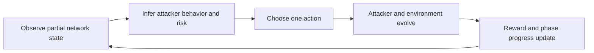

# ShadowNet: Teaching an AI Defender When Not to Strike

In cybersecurity, speed matters, but timing matters more.

A defender that reacts too early can destroy evidence, alert the attacker, and lose the chance to understand what is actually happening. Human analysts know this. They often watch quietly, gather clues, redirect the attacker into controlled systems, and only then contain the incident.

That is the gap ShadowNet is trying to model.

## What ShadowNet Is

ShadowNet is an OpenEnv-compatible cyber defense environment where the defender must contain an attacker without making it obvious that detection has already happened.

The environment is built around a more realistic question than "can the model block the threat?"

The better question is:

**Can the model act like a patient defender?**

That means:
- observing first
- choosing when to mirror traffic
- deciding when to redirect into honeypots
- preserving forensic evidence before it decays
- avoiding loud moves that cause the attacker to change behavior

## Why This Is Hard

The defender works under partial information.

It can see:
- anomalous nodes
- attacker behavior tier
- alerts
- available artifacts
- valid actions

It cannot directly see the hidden `detection_risk`, which represents how close the attacker is to realizing that the defender is onto them.

That missing variable matters because it changes the whole problem. The agent has to infer when patience is safe and when delay becomes dangerous.

## The Loop

The environment follows a simple but meaningful control loop:



Each episode moves through three phases:

1. `track`
2. `contain`
3. `evidence`

That structure forces long-horizon planning. A bad move in the tracking phase can ruin the evidence phase much later.

## What the Agent Can Do

The agent has a small but meaningful action space:
- `observe`
- `wait_and_track`
- `mirror_traffic`
- `redirect`
- `lock_artifact`
- `partial_covert`
- `loud_contain`
- `emergency_expel`

These are not cosmetic choices. They create real tradeoffs between stealth, speed, deception quality, and evidence preservation.

## Reward Design

ShadowNet uses six reward components:

```text
reward = 0.25 * asset_safety
       + 0.25 * forensic_value
       + 0.20 * stealth_score
       + 0.15 * honeypot_quality
       + 0.10 * phase_completion
       + 0.05 * efficiency
```

This prevents easy shortcuts. A policy that stays stealthy but protects nothing should not win. A policy that blocks everything immediately but destroys the investigation should not win either.

## Training Setup

The current training path in this repo uses:
- `Qwen/Qwen2.5-1.5B-Instruct`
- LoRA adapters
- `TRL SFTTrainer`
- a Colab notebook designed to be easy to rerun

The training notebook is here:
- [notebooks/ShadowNet_SFT_Colab.ipynb](notebooks/ShadowNet_SFT_Colab.ipynb)

The trained adapter kept in the repo is here:
- [artifacts/shadownet-sft-adapter](artifacts/shadownet-sft-adapter)

## What the Results Show

The repo includes real run artifacts, not just descriptions.

### Training loss


The loss curve shows that the model is learning a stable mapping from environment observations to structured actions.

### Trained vs baseline comparison


The comparison figure matters because it shows where training actually changes policy behavior relative to the built-in baseline.

### Baseline reference values

| Task | Random Score | Baseline Score |
|---|---:|---:|
| `shadow-easy` | ~0.36 | ~0.52-0.59 |
| `shadow-medium` | ~0.35 | ~0.47-0.50 |
| `shadow-hard` | ~0.35 | ~0.45-0.47 |

These numbers are useful because they show that ShadowNet is not a trivial environment. Even the baseline does not saturate the score, and performance gets harder as the scenarios become more complex.

## Why This Fits OpenEnv Well

OpenEnv is a good fit because ShadowNet is fundamentally stateful. The next observation depends on what the defender just did, what the attacker inferred, and which evidence is still available.

This is not a one-shot QA benchmark or a stateless tool-call task. It is a persistent environment where actions shape future context. That is exactly where the OpenEnv interface makes sense.

## Theme Alignment

ShadowNet fits most strongly into three of the listed hackathon themes.

### Theme #1: Multi-Agent Interactions

ShadowNet is not a static control problem. The defender and attacker are in an ongoing strategic interaction.

The attacker adapts to what the defender does:
- aggressive containment can trigger evasion
- good deception can keep the attacker engaged in controlled infrastructure
- hidden suspicion creates a genuine belief-modeling problem

That makes the environment useful for training theory-of-mind style behavior in partially observable settings.

### Theme #2: Long-Horizon Planning

ShadowNet also fits the long-horizon theme because success depends on sequencing actions over time with delayed consequences.

Examples:
- mirroring traffic early makes later redirect actions safer
- wasting steps in `track` can reduce what is still recoverable in `evidence`
- a bad early action can collapse the entire rest of the episode

This is exactly the kind of setup where shallow next-step heuristics break down.

### Theme #3.1: World Modeling / Professional Tasks

The environment models a real professional workflow rather than a synthetic puzzle:
- SIEM-style alerts
- containment decisions
- forensic artifact preservation
- attacker adaptation
- covert response tradeoffs

That gives the model a dynamic world where actions matter causally and state must be tracked over time.

## How This Maps to the Judging Criteria

### Environment Innovation

The main novelty is the capability being trained:
- not just detection
- not just blocking
- but covert containment under uncertainty

The environment is designed around a behavior gap that current AI security systems still handle poorly.

### Storytelling

The project is easy to explain because the central tradeoff is intuitive:
- act too early and you lose information
- wait too long and you lose control

That makes the behavior change after training visible in a way that is easier to understand than many abstract benchmarks.

### Showing Improvement in Rewards

The repo includes visible evidence of learning:
- a saved training loss plot
- a trained-vs-baseline comparison image
- baseline tables and evaluation outputs

The goal is not only to say that training happened, but to show where it changed policy behavior.

### Reward and Training Pipeline

The reward logic is multi-objective and deliberately hard to game. The pipeline is also end-to-end:
- generate expert traces from the environment
- fine-tune on those traces
- evaluate the resulting policy back inside the same environment

That keeps the training loop tied directly to the behavior the environment is supposed to teach.

## Why This Matters

The point of ShadowNet is not just to make another cyber benchmark. It is to test a more realistic defensive capability:

- can an agent delay action without freezing
- can it deceive instead of overreacting
- can it protect systems while still collecting evidence
- can it make decisions that look more like incident response than keyword matching

That is the behavior strong defenders rely on in the real world, and it is still mostly missing from current AI security systems.

## Final Thought

ShadowNet is built around a simple idea: in defense, the smartest action is often the one that buys information before it buys certainty.

If an AI defender is ever going to be useful in real incident response, it has to learn that difference.
