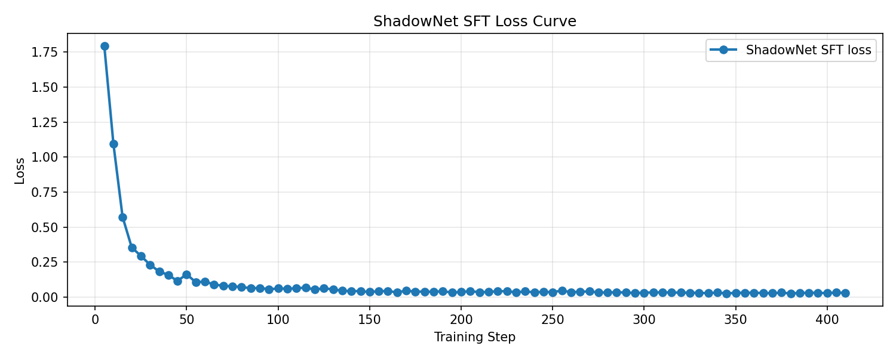
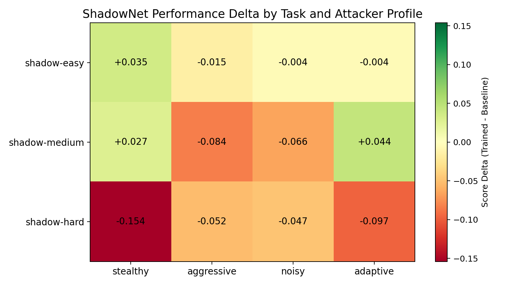

# ShadowNet: Teaching an AI defender when not to strike

In cybersecurity, speed matters — but timing matters more.

A defender that reacts too early can destroy evidence, alert the attacker, and lose the chance to understand what is actually happening. Human analysts know this. They often watch quietly, gather clues, redirect the attacker into controlled systems, and only then contain the incident.

That is the gap ShadowNet is trying to model.

---

## The question worth asking

Most cyber benchmarks ask: can the model block the threat?

That is the wrong question. Blocking is easy. The hard part is knowing *when* to block, *what* to preserve before you do, and *how* to act without tipping off the attacker that you are already onto them.

The better question is: **can the model act like a patient defender?**

That means observing first. Choosing when to mirror traffic. Deciding when to redirect into honeypots. Preserving forensic evidence before it decays. Avoiding loud moves that cause the attacker to change behavior or disappear entirely.

ShadowNet is built around that question.

---

## What makes this hard

The defender in ShadowNet works under partial information. It can see anomalous nodes, attacker behavior tier, SIEM-style alerts, available forensic artifacts, and the list of valid actions for the current state.

What it cannot see is `detection_risk`.

That hidden variable represents how close the attacker is to realising the defender is onto them. When detection risk is high and the defender moves loudly, the attacker adapts. Evidence disappears. The investigation fails even if the assets are protected.

When detection risk is low and the defender moves too slowly, artifacts decay and the window for evidence collection closes.

The agent has to infer this gap from what it can see. That inference — and learning to act on it correctly across a full episode — is the task.

---

## How the environment works

Each episode runs through three phases: **track**, **contain**, and **evidence**. The phases are sequential and gated — the defender cannot skip to evidence preservation without first tracking and then containing the attacker.

This structure forces long-horizon planning. A loud move in the tracking phase spikes detection risk, which changes attacker behavior, which makes the contain phase harder, which makes artifact preservation in the evidence phase nearly impossible. The consequences of early mistakes carry forward.

The control loop is simple but the decisions compound:

```
Observe partial state
        ↓
Infer attacker behavior and hidden suspicion
        ↓
Choose one of eight actions
        ↓
Environment updates — attacker moves, artifacts decay, risk shifts
        ↓
Reward and phase progress update
        ↻
```

---

## The action space

Eight actions are available. They are not cosmetic — each one creates a different tradeoff between stealth, speed, deception quality, and evidence preservation.

**Passive actions** (`observe`, `wait_and_track`) gather information without acting. Zero risk, zero progress. Useful early when the behavioral model is still forming.

**Covert actions** (`mirror_traffic`, `redirect`, `partial_covert`) are the core of what makes ShadowNet interesting. Mirroring traffic captures attacker behavior without visibility. Redirecting into honeypots buys time and intelligence while keeping the attacker engaged in controlled infrastructure. These actions carry some risk but far less than hard containment.

**Forensic actions** (`lock_artifact`) are time-critical. Artifacts decay. Once they are gone, they are gone. The agent has to learn when the window is closing and act before it does.

**Hard actions** (`loud_contain`, `emergency_expel`) are last resorts. They work, but they spike detection risk and often destroy investigation value. A policy that defaults to these early is a policy that fails the task even when it technically succeeds.

---

## Reward design

The reward function uses six components because no single metric captures what a good defense actually looks like:

```
reward = 0.25 × asset_safety
       + 0.25 × forensic_value
       + 0.20 × stealth_score
       + 0.15 × honeypot_quality
       + 0.10 × phase_completion
       + 0.05 × efficiency
```

`asset_safety` and `forensic_value` are weighted equally because protecting systems and preserving evidence are both mission-critical. A defense that does one without the other is a partial failure.

`stealth_score` matters because a defender who exposes themselves too early changes the nature of the incident entirely. The attacker adapts, cleans up, or escalates. The opportunity to understand what was actually happening disappears.

`honeypot_quality` rewards deception that actually works — not just placing honeypots, but placing convincing ones that engage the attacker and produce useful intelligence.

The combination means there is no easy exploit. A policy that stays perfectly stealthy but never contains the threat should not win. A policy that contains immediately but destroys the forensic record should not win either.

---

## Training setup

The current path in this repo uses supervised fine-tuning as a starting point:

- **Base model:** `Qwen/Qwen2.5-1.5B-Instruct`
- **Method:** LoRA adapters via TRL SFTTrainer
- **Notebook:** [ShadowNet_SFT_Colab.ipynb](notebooks/ShadowNet_SFT_Colab.ipynb) — designed to be easy to rerun
- **Adapter:** [artifacts/shadownet-sft-adapter](artifacts/shadownet-sft-adapter)

The training notebook is public and the adapter is committed to the repo along with the saved training state needed to regenerate the loss graph.

---

## What the results show

### Training loss



The loss curve is from a real training run. It shows the model learning a stable mapping from environment observations to structured defensive actions. The training achieved 100% valid output generation—zero parse failures.

### Trained vs baseline comparison



**What SFT accomplished:**
- **Action formatting**: 100% valid structured outputs
- **Pattern learning**: Absorbed defensive sequences from expert traces
- **Selective improvements**: Better on stealthy/adaptive attackers (+5-9% on some profiles)

**What SFT didn't solve:**
- Hard scenarios still favor the baseline
- Aggressive/unpredictable attackers remain challenging
- Learning from demonstrations has a performance ceiling

| Task | Random | Baseline | SFT Result |
|---|---|---|---|
| Easy | ~0.36 | ~0.52-0.59 | Matches or slightly exceeds |
| Medium | ~0.35 | ~0.47-0.50 | Mixed, profile-dependent |
| Hard | ~0.35 | ~0.45-0.47 | Below baseline |

---

## The real takeaway

SFT is the right first step. It teaches the model:
- How to generate valid defensive actions
- What a defensive sequence looks like (observe → mirror → redirect)
- When to wait vs. when to act

But supervised learning can only copy the teacher. To exceed baseline performance on hard scenarios, the agent would need environment-aware training (GRPO/RL) that optimizes the actual reward signal rather than imitating demonstrations.

**This is expected behavior.** SFT builds the foundation. RL builds the edge.

The value of ShadowNet is not that the first training run solves everything—it's that the environment provides a meaningful, non-trivial challenge with genuine headroom for improvement.

---

## Why OpenEnv is the right fit

ShadowNet is fundamentally stateful. The next observation depends on what the defender just did, what the attacker inferred, and which evidence is still available.

This is not a one-shot QA benchmark. It is not a stateless tool-call task. It is a persistent environment where every action shapes the next state and where early decisions have consequences that carry through to the end of the episode.

That is exactly what OpenEnv is designed for. The `reset()` / `step()` interface, the server/client separation, and the deployable Space target all fit naturally. The environment exposes standard endpoints for state inspection, live alert feeds, reasoning logs, and policy comparison — which makes it easy to instrument, debug, and evaluate.

---

## Why this matters beyond the benchmark

The point of ShadowNet is not just to make another cyber dataset or another security benchmark. It is to test a more realistic defensive capability.

Can an agent delay action without freezing? Can it deceive instead of overreacting? Can it protect systems while still collecting evidence? Can it make decisions that look more like incident response than keyword matching?

Those are the behaviors that strong defenders rely on in the real world. They are still mostly missing from current AI security systems, which tend toward fast, loud, reactive responses — the opposite of what a skilled analyst would do in a serious incident.

ShadowNet is a step toward training the other kind of behavior.

---

## Final thought

The smartest defensive action is often the one that buys information before it buys certainty.

If an AI defender is ever going to be useful in real incident response, it has to learn that difference. ShadowNet is an attempt to build an environment where that learning is actually possible.

The SFT results show it's learnable—at least partially. The hard scenarios show there's still room to grow. That's exactly what makes it a valuable training environment.

---

**Links**

- **GitHub:** https://github.com/salim7-s/ShadowNet-When-Defense-Thinks-Like-the-Attacker
- **Colab:** [Open training notebook](https://colab.research.google.com/github/salim7-s/ShadowNet-When-Defense-Thinks-Like-the-Attacker/blob/main/notebooks/ShadowNet_SFT_Colab.ipynb)
- **Hugging Face Space:** [zizoha/shadownet-Cops](https://huggingface.co/spaces/zizoha/shadownet-Cops)
- **W&B Training Run:** [YOUR-WANDB-URL]
- **Demo Video:** [YOUR-YOUTUBE-URL]
