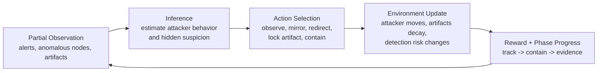

# ShadowNet: Deceptive Containment for Cyber Defense Agents

ShadowNet is an OpenEnv-compatible cyber defense environment where the defender is not rewarded for reacting loudly or immediately. The task is to contain an attacker while staying covert long enough to understand what they are doing, redirect them into controlled infrastructure, and preserve evidence before it disappears.

The core idea is simple: in real incident response, the best move is often not "block now." Good defenders track, deceive, and contain.

**Quick links:** [Blog Post](BLOG_POST.md) · [Training Guide](TRAINING.md) · [Colab Notebook](notebooks/ShadowNet_SFT_Colab.ipynb) · [License](LICENSE)

[](https://colab.research.google.com/github/salim7-s/ShadowNet-When-Defense-Thinks-Like-the-Attacker/blob/main/notebooks/ShadowNet_SFT_Colab.ipynb)

## Quick View

What this repo includes:
- an OpenEnv-compatible environment with a Hugging Face Space deployment path
- a working Colab training notebook
- a trained adapter artifact in `artifacts/shadownet-sft-adapter`
- real training evidence in `training/sft_loss_curve.png`
- a trained-vs-baseline comparison image in `training/trained_vs_baseline_heatmap_better.png`

Why this environment matters:
- the defender must reason about a hidden attacker suspicion state
- the reward favors patience, deception, and evidence preservation
- the task is long-horizon and phase-dependent rather than one-step reactive

## What the Environment Does

The defender sees a partial view of an active intrusion:
- anomalous nodes
- attacker behavior tier
- SIEM-style alerts
- available forensic artifacts
- valid actions for the current state

The defender does **not** directly observe the internal `detection_risk`. That hidden variable is what makes the task interesting: the agent must infer when the attacker is getting suspicious.

The episode is structured in three phases:

1. `track`
2. `contain`
3. `evidence`

Available actions include:
- `observe`
- `wait_and_track`
- `mirror_traffic`
- `redirect`
- `lock_artifact`
- `partial_covert`
- `loud_contain`
- `emergency_expel`

## Environment Flow



This loop is what makes ShadowNet closer to real defensive decision-making than a standard "detect and classify" task.

## Reward Design

The final score is a weighted combination of six signals:

```text
reward = 0.25 * asset_safety
       + 0.25 * forensic_value
       + 0.20 * stealth_score
       + 0.15 * honeypot_quality
       + 0.10 * phase_completion
       + 0.05 * efficiency
```

This matters because a policy can look good on one metric while still failing the actual mission. A stealthy policy that preserves no evidence is not enough. A loud containment policy that protects assets but destroys the investigation is not enough either.

## OpenEnv Fit

The repo follows the OpenEnv pattern closely:
- `openenv.yaml` defines the environment manifest
- the server exposes a standard environment interface
- the environment supports `reset`, `step`, and state inspection
- the repo includes a runnable notebook and deployment path for Hugging Face Spaces

This matches the structure described in the OpenEnv documentation: an environment definition, a server app, a client path, and a deployable package.

## Theme Fit

ShadowNet fits most strongly into three hackathon themes:

### Theme #1: Multi-Agent Interactions

The attacker and defender continuously influence each other. The defender must model hidden attacker belief and suspicion rather than acting against a fixed world.

### Theme #2: Long-Horizon Planning

The task spans `track -> contain -> evidence`, with delayed consequences and sparse payoff. Early mistakes can reduce later options.

### Theme #3.1: World Modeling / Professional Tasks

The environment represents a realistic cyber defense workflow with alerts, artifacts, containment tradeoffs, and attacker adaptation inside a partially observable world.

## Training Setup

The current training path is based on supervised fine-tuning:
- base model: `Qwen/Qwen2.5-1.5B-Instruct`
- training method: LoRA adapters
- trainer: `TRL SFTTrainer`
- notebook: [notebooks/ShadowNet_SFT_Colab.ipynb](notebooks/ShadowNet_SFT_Colab.ipynb)

The trained adapter kept in this repo is:
- [artifacts/shadownet-sft-adapter](artifacts/shadownet-sft-adapter)

That folder contains the adapter weights plus the saved training state needed to regenerate the loss graph.

## Results

### Training Loss

The notebook saves a spike-style loss curve from the real trainer state:


This provides a direct record of an actual training run rather than only a written description.

### Trained vs Baseline Comparison

The repo also includes a direct comparison figure:


The main pattern is straightforward: the trained policy starts to make better phase-aware decisions in several task/profile combinations, especially where stealth and sequencing matter.

## Why This Matters

ShadowNet is meant to teach a capability that remains underexplored in current AI security systems:
- when to delay action
- how to contain without revealing detection
- how to preserve evidence while still protecting assets

That is the difference between a system that only reacts and a system that behaves more like a careful defender.

### Baseline Reference

Current baseline ranges in the repo:

| Task | Random Score | Baseline Score |
|---|---:|---:|
| `shadow-easy` | ~0.36 | ~0.52-0.59 |
| `shadow-medium` | ~0.35 | ~0.47-0.50 |
| `shadow-hard` | ~0.35 | ~0.45-0.47 |

Detailed outputs:
- [training/eval_baseline.json](training/eval_baseline.json)
- [training/eval_baseline_table.md](training/eval_baseline_table.md)
- [artifacts/eval_summary.md](artifacts/eval_summary.md)

## Repo Layout

```text
.
├── openenv.yaml
├── Dockerfile
├── environment.py
├── grader.py
├── data.py
├── agent.py
├── inference.py
├── client.py
├── eval_harness.py
├── server/
├── training/
│   ├── sft_loss_curve.png
│   └── trained_vs_baseline_heatmap_better.png
├── artifacts/
│   └── shadownet-sft-adapter/
├── notebooks/
│   └── ShadowNet_SFT_Colab.ipynb
├── TRAINING.md
└── BLOG_POST.md
```

## Main Endpoints

| Endpoint | Method | Purpose |
|---|---|---|
| `/health` | GET | liveness check |
| `/tasks` | GET | task metadata |
| `/reset` | POST | start an episode |
| `/step` | POST | apply one action |
| `/state` | GET | debug state |
| `/grader` | GET | grading breakdown |
| `/baseline` | GET | baseline performance |
| `/network-state` | GET | graph state for dashboard |
| `/siem-alerts` | GET | live alert feed |
| `/reasoning-log` | GET | structured action reasoning |
| `/demo/compare` | GET | good vs bad policy comparison |

## Deployment Checklist

- [ ] Push repo to GitHub
- [ ] Deploy Docker Space on Hugging Face
- [ ] Verify `/health`, `/tasks`, `/baseline`, and `/demo/compare`
- [ ] Keep the Colab notebook public
- [ ] Keep the Space public
- [ ] Add the public Space URL below
- [ ] Add the public W&B URL below
- [ ] Add a public short video URL if used

## Links

- **GitHub:** https://github.com/salim7-s/ShadowNet-When-Defense-Thinks-Like-the-Attacker
- **Hugging Face Space:** [YOUR-SPACE-URL](https://huggingface.co/spaces)
- **Training Notebook:** [Open in Colab](https://colab.research.google.com/github/salim7-s/ShadowNet-When-Defense-Thinks-Like-the-Attacker/blob/main/notebooks/ShadowNet_SFT_Colab.ipynb)
- **Training Evidence (W&B):** [YOUR-WANDB-RUN-URL](https://wandb.ai)
- **Blog Post:** [BLOG_POST.md](BLOG_POST.md)
- **Short Demo Video:** [YOUR-YOUTUBE-URL]

## OpenEnv Compliance

- Uses an OpenEnv-compatible environment server structure
- Includes `openenv.yaml`
- Supports standard `reset()` / `step()` flow
- Exposes a deployable Hugging Face Space target
- Includes a re-runnable training notebook and result artifacts
